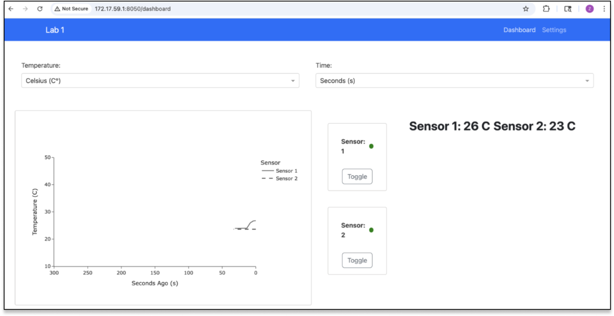

# L1-web-server
Plotly Dash Web-Server Responsible for displaying the temperature readings visually.



## Data Sharing and Storage

Dash is session-based per client, which makes viewing and modifying the system between multiple users troublesome.  
We want the status and stream of data to be identical across clients. For example, if client 'A' turns sensor 1 on, this is reflected in client 'B's view.

To achieve performance and persistence, we employ the following architecture:

### 1. Global State: Redis
**Purpose:** Shared, real-time state across all clients  
**Stored globally:**
- Sensor 1 status
- Sensor 2 status
- Streaming data

### 2. Session State: `dcc.Store` (Client-side Browser Cache)
**Purpose:** Per-user session state for UI selections  
**Cached locally:**
- Temperature unit selection
- Timeframe selection

### 3. Persistent Storage: SQLite Database
**Purpose:** Long-term, reliable data storage  
**Persisted:**
- Streaming data (written by the embedded program)

---

## Project Setup

### Setting up the Project

Using [UV](https://docs.astral.sh/uv/) as the package manager (≤10x faster than pip, also handles venv):

1. Ensure you have Python 3.12 or later installed.
2. Install `uv` globally:
   ```sh
   pip install uv
   ```
3. Sync dependencies from `pyproject.toml`:
   ```sh
   uv sync
   ```
4. Run the application:
   ```sh
   uv run app/app.py
   ```

---

## Running Ruff

Optional code quality check using [Ruff](https://docs.astral.sh/ruff/):

1. Install `ruff`:
   ```sh
   uv add --dev ruff
   ```
2. Check for syntax issues:
   ```sh
   uv run ruff check
   ```
3. Automatically fix issues:
   ```sh
   uv ruff check --fix
   ```
