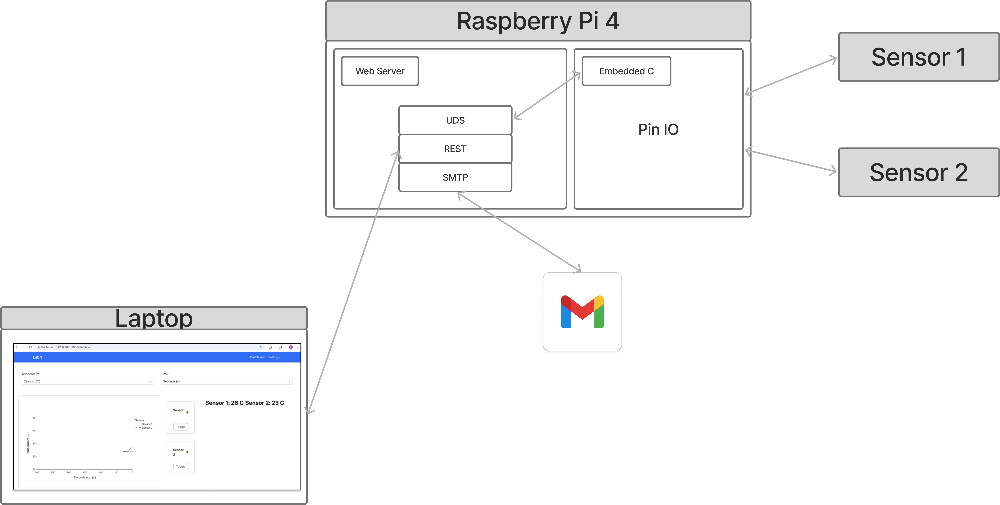
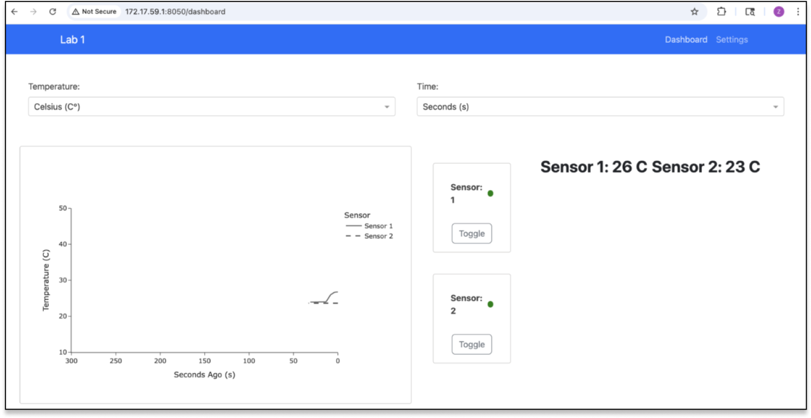

# L1-web-server
Plotly Dash Web-Server Responsible for displaying the temperature readings visually.

<div align="center">
  
  <div><em>System Architecture</em></div>
   <br>
</div>

<div align="center">
  
  <div><em>Dashboard</em></div>
</div>

### Setting up the Project

Using [UV](https://docs.astral.sh/uv/) as the package manager (≤10x faster than pip, also handles venv):

1. Ensure you have Python 3.12 or later installed.
2. Install `uv` globally:
   ```sh
   pip install uv
   ```
3. Sync dependencies from `pyproject.toml`:
   ```sh
   uv sync
   ```
4. Run the application:
   ```sh
   uv run app/app.py
   ```
